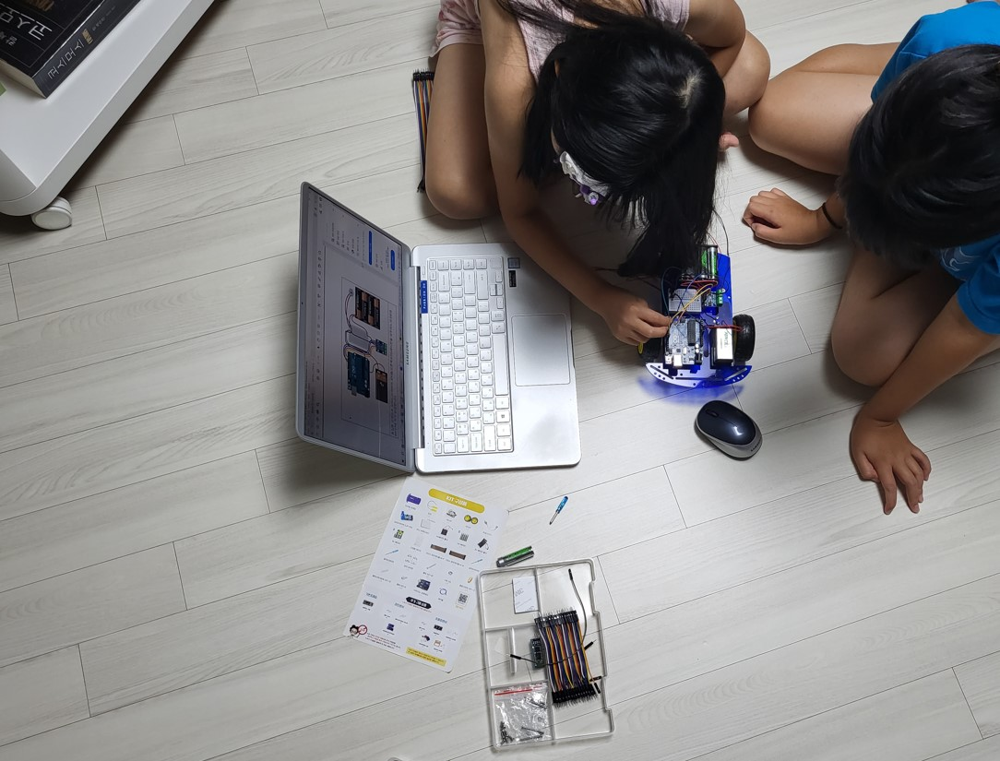

# 드림캠프 - 스마트 RC카 만들기

엄마, 아빠는 반도체 회사에서 어떤 것을 만드는 것일까? 시커먼 초코렛 조각 같은 반도체는 녹색판에 붙어서 무얼하고 있는걸까?

전기와 반도체 그리고 프로그래밍에 대해서 알아보고, 그 기술로 동작하는 스마트 RC카를 만들어보자!

## 강의 프로그램
1. [강의 소개 (10분)](./introduce)
1. [전기와 반도체 그리고 프로그래밍 (15분)](./semiconductor)
 - 신호와 반도체, 코딩과 프로그래밍의 개념을 이해해보자
1. [LED 깜빡이기 (15분)](./led)
 - 첫 프로그래밍 경험을 통해 창조 욕구를 발산해보자
1. [초음파 센서로 장애물까지 거리측정 하기 (15분)](./ultrasound)
 - 과학 공식이 삶이 도움이 된다는 것을 확인해보자
1. [자동차 본체 조립 (15분)](./car-assembly)
 - 잠깐 쉬면서 신나게 조립해보자
1. [자동차 배선하기 (15분)](./car-circuit)
 - 전체 회로의 구성을 이해하면서 연결해보자
1. [장애물을 인식 자동차 프로그래밍 (15분)](./car-programming)
 - 작은 성취감을 주는 디딤판을 만들어보자
1. 마무리 (20분)
 - 집으로 돌아 가서도 도전은 계속된다!

## 도전과제
- [LED 2개 깜빡이기](./led-quiz)
- [초음파 센서로 거리 측정해서 LED 깜빡여보기](./ultrasound-quiz)
- [Buzzer로 멜로디를 재생해보기](./buzzer-quiz)
- [블루투스로 자동차 조종하기](./car-bt)
- [장애물을 피하면서 이동하는 자동차 만들기](./smart-car)

## 사용된 부품 및 가격
- [RC카 기본 세트 - 47,850원](https://www.devicemart.co.kr/goods/view?no=1385495)
- [초음파 센서 브라켓 - 495원](https://www.devicemart.co.kr/goods/view?no=1323060)
- [초음파 센서 - 1,430원](https://www.devicemart.co.kr/goods/view?no=1076851)
- [LED 녹색 - 77원](https://www.devicemart.co.kr/goods/view?no=2853)
- [LED 빨간색 - 77원](https://www.devicemart.co.kr/goods/view?no=2851)
- [저항 220ohm - 15원](https://www.devicemart.co.kr/goods/view?no=890)
- [스위치 - 88원](https://www.devicemart.co.kr/goods/view?no=1361702)
- [피에조 부저 - 330원](https://www.devicemart.co.kr/goods/view?no=1361187)

합계 - 50,362원 (VAT 포함)

## TODO
- 자동차 배선, 조립, 초음파 센서 사진 추가
- LED Quiz, 참고 답안 회로 및 사진 업데이트

- 초음파 센서 실행화면, 시리얼 모니터 화면 캡쳐
- 초음파 센서 데모 사진
- 초음파센서, 참고 답안 회로 및 사진 업데이트, 동영상
- 버저 회로도와 사진
- 최종 화면 검수
- 최종 프로그램 파일 모두 따로 저장해두기
