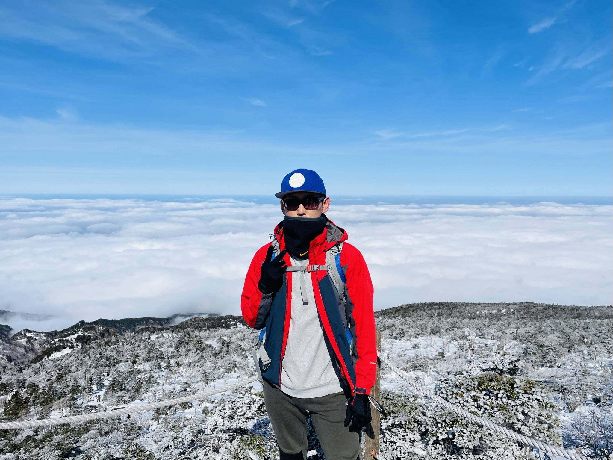
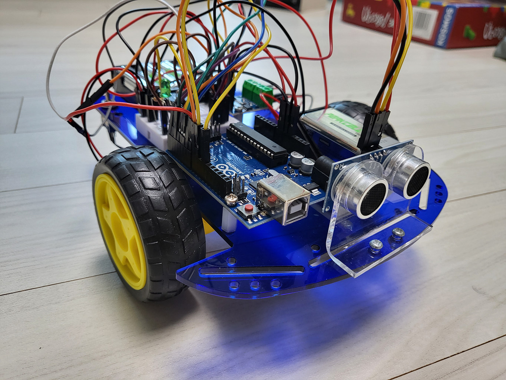

author: Jeong Seongmoon
summary: 강의 소개
id: introduce
categories: codelab
environments: Web
status: Published
feedback link: https://github.com/msaltnet/coding-camp

# 강의 소개

## 강사소개
Duration: 0:02:00

[맛소금](https://me.msalt.net) - 지구별 대한민국의 용산에서 나고 자란 평범한 개발자 입니다. 

## 오늘 배울것
Duration: 0:05:00

반도체와 프로그래밍에 대해서 배우고, 반도체와 전기 에너지를 사용해서 동작하는 똑똑한 자동차를 직접 만들어 봅니다.

[동작 동영상](https://www.youtube.com/watch?v=RbDGxCBN8vQ)

## 정리
Duration: 0:03:00

매우 짧은 시간이라서 많은 것을 하지는 못하지만, 반도체와 프로그래밍을 조금 맛보는 시간이 될 수 있었으면 좋겠어요.

**중요한 것은 당장은 재미있게 즐기기 그리고 천천히 생각해보고 질문해보기!!!**

재료는 집에 가지고 갈 수 있고, 자료는 집에서도 볼 수 있으니 잘 이해가 안된다고 답답해하지 말고, 나중에 다시 시작해봐도 좋아요.

간단한 프로그램부터 복잡한 프로그램까지 모두 자료가 준비되어 있으니 스스로 천천히 익혀보세요.

도전해 볼 수 있는 도전 강의 자료도 준비해 두었어요.
