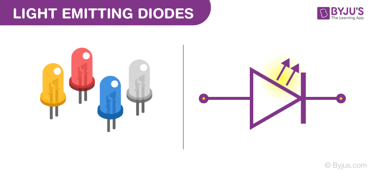
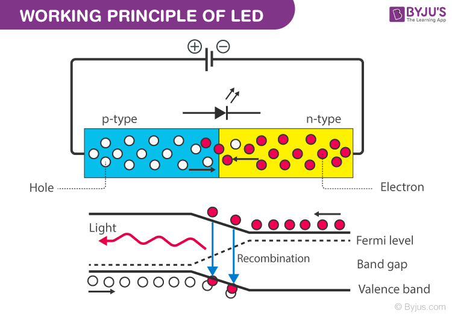
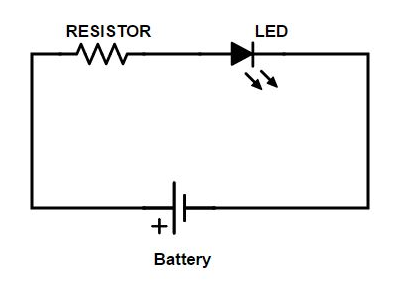
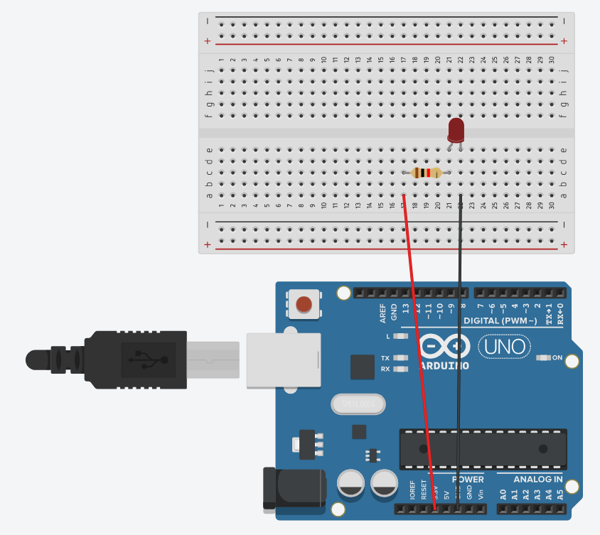
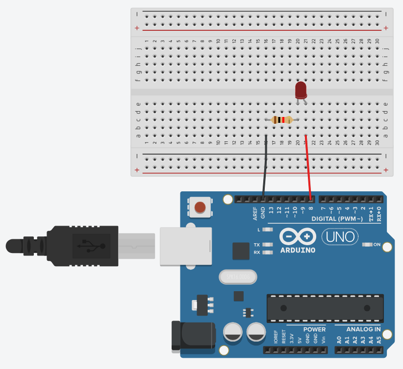
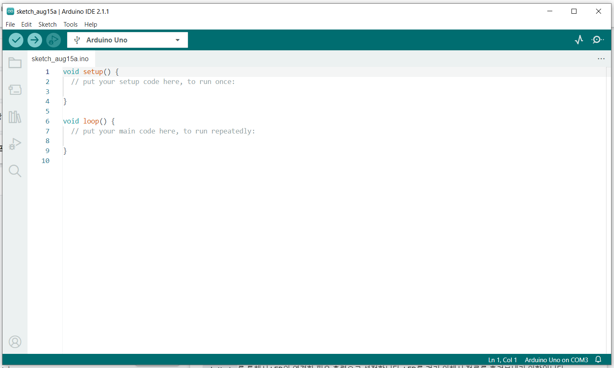
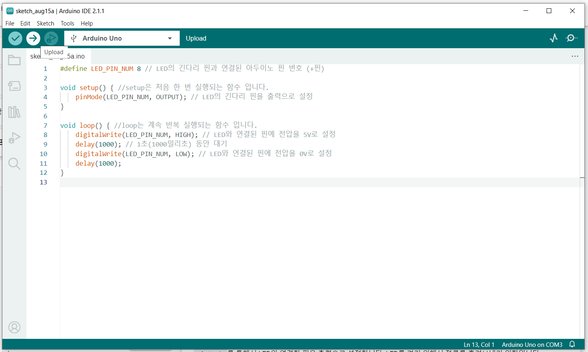
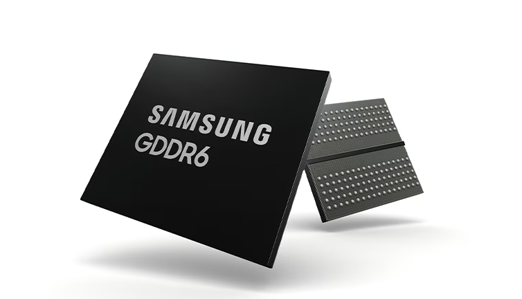

author: Jeong Seongmoon
summary: LED 깜빡이기
id: led
categories: codelab
environments: Web
status: Published
feedback link: https://github.com/msaltnet/coding-camp

# LED 깜빡이기

## 시작하기
Duration: 0:01:00

LED에 대해서 알아보고 아두이노를 통해서 LED를 깜빡이는 방법에 대해서 알아봅니다.

### 사전 준비
1. 아두이노 보드
1. 아두이노와 연결 가능한 PC와 IDE
1. 브레드보드
1. LED 소자
1. 저항 220옴

### 배우게 될 것
1. LED란 무엇인가
1. LED와 저항의 연결 방법
1. LED를 깜빡이는 프로그램 작성 및 실습

## LED란
Duration: 0:02:00

**전기가 통하면 빛이 나는 반도체 소자!**

"A light-emitting diode (LED) is a semiconductor device that emits light when an electric current flows through it. When current passes through an LED, the electrons recombine with holes emitting light in the process."

"발광 다이오드(LED)는 전류가 흐르면 빛을 발하는 반도체 소자입니다. 전류가 LED를 통과하면 전자가 정공과 재결합하여 빛을 발산합니다."

[Light Emitting Diode (LED)](https://byjus.com/physics/light-emitting-diode/#:~:text=Asked%20Questions%20%E2%80%93%20FAQs-,What%20is%20LED%3F,emitting%20light%20in%20the%20process)



회도로에서 심볼은 삼각형으로 표시합니다. 삼각형의 꼭짓점이 빛이 나는 방향을 나타냅니다.

LED는 다이오드의 한 종류로써 전류가 한 방향으로만 흐를 수 있습니다. P형 반도체와 N형 반도체를 합쳐서 만들어진 소자인데, 자세한 동작원리가 궁금하다면 아래 링크를 참고하세요.

[반도체란 무엇일까? 3편 - 다이오드란?](https://blog.naver.com/PostView.naver?blogId=jamduino&logNo=220917730997)



## LED와 저항의 연결
Duration: 0:05:00

**LED에 전류가 너무 많이 흐르면 소자가 망가질 수 있어요.** 적정량의 전류를 흐르게 하기 위해서 저항과 함께 연결해야 합니다.

저항의 전기가 흐르는 것을 방해하는 정도를 뜻하지만, 전류의 양을 조절하기 위한 저항소자도 보통 저항이라고 부릅니다.

"전기저항(電氣抵抗, electrical resistance)은 도체에서 전류의 흐름을 방해하는 정도를 나타내는 물리량이다. 국제단위계 단위는 옴이고 
Ω\Omega 로 나타낸다. 전기 회로 이론에서는 간단히 줄여 저항이라고 부른다. - [전기저항 위키백과](https://ko.wikipedia.org/wiki/%EC%A0%84%EA%B8%B0%EC%A0%80%ED%95%AD)"

저항소자는 다양한 종류가 있지만 우리가 사용하는 것은 아래와 같이 생긴 띠 저항이며, 색을 통해서 저항의 크기를 확인 할 수 있습니다.


준비한 LED의 필요 전압은 2V이며, 소모 전류는 25mA입니다. 아두이노에서 나오는 전압은 5V이기 때문에 필요한 저항은 120Ω 정도 된다는 것을 다음 옴의 법칙의 공식을 통해 계산할 수 있습니다.

V(전압) = I(전류) x R(저항)

다음과 같이 저항과 LED, 전지를 직렬로 연결하면 원하는 양의 전류를 LED에 흐르게 할 수 있습니다.



[LED - 전류제한저항이란?](https://blog.naver.com/NBlogTop.naver?isHttpsRedirect=true&blogId=jamduino&Redirect=Dlog&Qs=/jamduino/220822597063)

아래와 같이 회로를 구성하면 아두이노에서 나오는 5V 전원을 이용해서 LED를 켤 수 있습니다.



*아두이노에 전원을 연결해 줘야합니다. 컴퓨터와 USB연결

## 깜빡이게 프로그래밍하기
Duration: 0:06:00

이번에는 단순히 전원이 들어와서 불이 켜져있는 것이 아니라 프로그램으로 불을 켜고 끄는 것을 해보겠습니다.

아래와 같이 회로를 구성해서 아두이노의 출력핀이 LED와 연결되게 합니다.



컴퓨터에 아두이노 IDE를 실행합니다. IDE는 프로그램을 작성하고, 작성된 프로그램을 기계 언어로 만들어서 아두이노에 저장(업로드) 할 수 있는 컴퓨터 프로그램입니다.



아래와 같이 프로그램을 입력하거나 복사해서 붙여 넣어주세요.

```c
#define LED_PIN_NUM 8 // LED의 긴다리 핀과 연결된 아두이노 핀 번호 (+핀)

void setup() { //setup은 처음 한 번 실행되는 함수 입니다.
  pinMode(LED_PIN_NUM, OUTPUT); // LED의 긴다리 핀을 출력으로 설정
}

void loop() { //loop는 계속 반복 실행되는 함수 입니다.
  digitalWrite(LED_PIN_NUM, HIGH); // LED와 연결된 핀에 전압을 5V로 설정
  delay(1000); // 1초(1000밀리초) 동안 대기
  digitalWrite(LED_PIN_NUM, LOW); // LED와 연결된 핀에 전압을 0V로 설정
  delay(1000);
}
```

다음으로 왼쪽 위에 업로드 버튼을 눌러서 LED를 깜빡이게 해보세요.



`void setup()`은 아두이노를 켰을때 한 번 실행되며, `void loop()`는 계속 반복 실행됩니다.

`pinMode`를 통해서 LED와 연결한 핀을 출력으로 설정합니다. LED를 켜기 위해서 전류를 흘려보내기 위함입니다.

`digitalWrite`를 통해서 연결된 핀의 출력을 설정합니다. `HIGH`로 설정하면 5V의 전압으로 핀에 전류가 흐르기 때문에 LED가 켜지고, `LOW`로 설정하면 꺼집니다.

`delay`는 전달받은 숫자의 ms(밀리세컨드)만큼 프로그램 진행을 잠시 대기합니다. 프로그램은 한 줄씩 차례대로 실행되는데, `delay`를 만나면 다음 줄로 넘어가지 않고 기다리는 것과 같습니다.

*ms* milliseconds는 1/1000 초 입니다. 따라서 1000ms는 1초입니다.

<aside class="positive">
코드를 수정해서 깜빡이는 속도를 조절해 보세요. 눈으로 깜빡임을 확인할 수 있는 정도는 얼마나 될까요?
</aside>

## 정리
Duration: 0:01:00

아두이노와 브레드보드, LED, 저항을 이용해서 간단한 프로그래밍을 해보았습니다.

처음 배운것이 많아서 복잡해 보이지만 사실 매우 간단합니다.

- LED는 전기가 흐르면 빛이 나도록 만든 반도체 소자다.
- 반도체를 통해서 신호를 마음대로 프로그래밍 할 수 있는 전자제품을 만들 수 있다.
- 그리고 그것들을 이용해서 LED를 깜빡거리게 할 수 있다.


