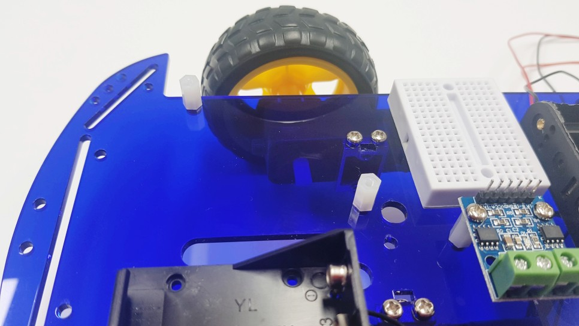

author: Jeong Seongmoon
summary: 자동차 본체 조립
id: car-assembly
categories: codelab
environments: Web
status: Published
feedback link: https://github.com/msaltnet/coding-camp

# 자동차 본체 조립

## 시작하기
Duration: 0:02:00

자동차의 본체를 조립해보겠습니다. 부품이 모두있는지 확인하고, 차근차근 조립해봅시다.

### 사전 준비
1. 자동차 조립 키트
2. 가위

### 배우게 될 것
1. 자동차의 본체를 조립하는 방법

## 모터 조립
Duration: 0:03:00

모터 2개, 브라켓(네모난 틀) 2개, 긴 볼트 4개, 너트 4개를 준비합니다.

돌출부가 없는 평평한 면에 브라켓이 오도록하고 긴 볼트를 구멍에 넣고 너트를 돌려서 조립합니다.

너트가 브라켓 쪽으로 오도록 조립합니다.

아크릴에 비닐이 붙어있다면 미리 제거합니다.

모터를 아크릴에 체결하기 위해 짧은 볼트 4개와 아크릴을 준비합니다. 

아크릴에 세로로 길게 뚫린 홈이 있는데 왼쪽에 오도록 조립합니다. 사진을 잘 보고 따라 하세요.

아크릴 아래 모터를 놓고 볼트를 아크릴 위해서 채워줍니다. 드라이버를 이용하세요.

## 바퀴 조립
Duration: 0:03:00

뒷바퀴(캐스터)를 조립하기 위해서 황동 서포트(노란 막대) 4개와 짧은 볼트 8개를 준비합니다.

먼저 황동 서포트를 아크릴에 조립합니다. 짧은 볼트를 이용해서 채워주세요. 완전히 조이지 말고 뒷바퀴(캐스터)를 조립 후 단단히 조여주세요.

이제 황동 서포트에 뒷바퀴(캐스터)를 조립해주세요. 아크릴 구멍위치가 잘 안맞으면 황동 서포트를 움직여서 맞춰줍니다.

바퀴를 모터에 끼워 주세요.

## 배터리 홀더와 브레드보드 조립
Duration: 0:03:00

모터에 전원을 공급하기 위한 AA배터리 홀더를 테이프로 붙여주세요. 폼테이프를 가위로 적당히 오려서 사용하세요.

후미 중앙 적당한 위치에 부착합니다. 출력 와이어의 위치는 오른쪽으로 향하는 편이 배선하기 편리합니다.

온오프 스위치에 해당하는 토글 스위치를 준비합니다. 결합하기 위해 이붙이 와셔와 너트를 분리합니다.

너트 - 이붙이 와셔 - 아크릴 - 스위치 순서로 조립합니다.

모터 드라이버와 플라스틱 서포트 2개, 짧은 볼트 4개를 준비합니다.

볼트를 이용해서 서포트를 아크릴 보드에 부착합니다.

남은 볼트로 모터 드라이버를 서포트 위에 고정합니다.

미니 브래드 보드를 아크릴보드 위에 부착합니다. 다른 구멍을 가리지 않도록 사진과 같이 부착합니다.

아두이노에 전원을 공급하는 9V 배터리 홀더를 폼테이프를 이용해서 부착합니다.

## 아두이노 보드 조립
Duration: 0:03:00

아두이노 보드는 플라스틱 서포트 2개와 짧은 볼트 4개를 이용해서 아크릴 보드에 부착합니다.

서포트를 먼저 아크릴보드 위에 고정하고 보드를 고정합니다. 방향은 사진과 같이 해주세요.

## 정리
Duration: 0:01:00

자동차 기구의 조립을 마쳤습니다. 자동차가 완성되니 빨리 움직이게 만들고 싶어지네요.

다음은 회로를 구성하는 배선 작업이 필요합니다.

### 참고자료
- [블루RC카 사용설명서](https://www.devicemart.co.kr/goods/download?id=1385495&rank=1)
- [아두이노 스마트 RC카 블록코딩 메뉴얼](https://www.devicemart.co.kr/goods/download?id=1385495&rank=2)