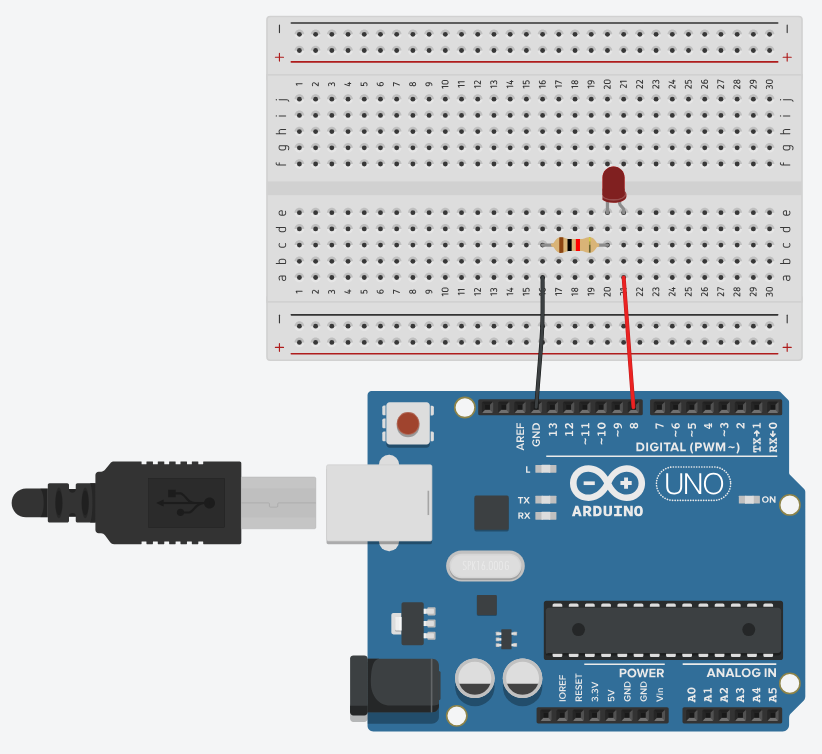

author: Jeong Seongmoon
summary: LED 2개 깜빡이기
id: led-quiz
categories: codelab
environments: Web
status: Published
feedback link: https://github.com/msaltnet/coding-camp

# LED 2개 깜빡이기

## 시작하기
Duration: 0:01:00

LED 깜빡이는 방법에 대해서 배웠습니다. 그렇다면 2개를 깜빡이는 것은 어떻게 할 수 있을까요?

앞에서 배운 내용을 바탕으로 혼자 고민해보면서 만들어 보세요!

### 사전 준비
1. 아두이노 보드
1. 아두이노와 연결 가능한 PC와 IDE
1. 브레드보드
1. LED 소자 2개
1. 저항 220옴 2개

### 배우게 될 것
1. LED를 2개 깜빡이는 프로그램 작성 및 실습

// 완성 제품

## 회로 만들기
Duration: 0:10:00

LED에 전류가 많이 흐르면 소자가 망가집니다. 적정량의 전류를 흐르게 하기 위해서 저항과 함께 연결해야 합니다.

2개의 LED를 아두이노에 따로 연결해주세요. 그리고 각각 저항과 함께 연결해 보세요.

## 참고 답안 회로
Duration: 0:05:00

연결하는 방법은 한 가지로 정해져 있는 것이 아닙니다. 답안은 참고용으로 사용하세요.

중요한 것은 저항과 LED, 아두이노 핀은 하나씩 함께 연결되어야 합니다.



## 프로그래밍
Duration: 0:10:00

앞에서 사용했던 프로그램을 조금 수정해서 2개를 차례대로 꺼지고 켜지는 프로그램을 만들어 보세요.

아래의 프로그램을 참고해서 사용해보세요.

```c
#define LED_PIN_NUM 8 // LED의 긴다리 핀과 연결된 아두이노 핀 번호 (+핀)

void setup() { //setup은 처음 한 번 실행되는 함수 입니다.
    pinMode(LED_PIN_NUM, OUTPUT); // LED의 긴다리 핀을 출력으로 설정
}

void loop() { //loop는 계속 반복 실행되는 함수 입니다.
    digitalWrite(LED_PIN_NUM, HIGH); // LED와 연결된 핀에 전압을 5V로 설정
    delay(1000); // 1초(1000밀리초) 동안 대기
    digitalWrite(LED_PIN_NUM, LOW); // LED와 연결된 핀에 전압을 0V로 설정
    delay(1000);
}
```

## 참고 답안 프로그램
Duration: 0:05:00

프로그래밍 방법은 한 가지로 정해져 있는 것이 아닙니다. 답안은 참고용으로 사용하세요.

중요한 것은 저항과 LED, 아두이노 핀 번호를 잘 입력해줘야 합니다.

```c
#define LED_PIN_NUM 8 // LED의 긴다리 핀과 연결된 아두이노 핀 번호 (+핀)
#define LED_PIN_NUM_2 9 // 두번째 LED의 긴다리 핀과 연결된 아두이노 핀 번호 (+핀)

void setup() { //setup은 처음 한 번 실행되는 함수 입니다.
  pinMode(LED_PIN_NUM, OUTPUT); // LED의 긴다리 핀을 출력으로 설정
  pinMode(LED_PIN_NUM_2, OUTPUT); // 두번째 LED의 긴다리 핀을 출력으로 설정
}

void loop() { //loop는 계속 반복 실행되는 함수 입니다.
  digitalWrite(LED_PIN_NUM, HIGH); // LED와 연결된 핀에 전압을 5V로 설정
  digitalWrite(LED_PIN_NUM_2, LOW); // 두번째 LED와 연결된 핀에 전압을 0V로 설정
  delay(1000); // 1초(1000밀리초) 동안 대기
  digitalWrite(LED_PIN_NUM, LOW); // LED와 연결된 핀에 전압을 0V로 설정
  digitalWrite(LED_PIN_NUM_2, HIGH); // 두번째 LED와 연결된 핀에 전압을 5V로 설정
  delay(1000);
}
```

## 정리
Duration: 0:01:00

직접 해보면서 아두이노와 브레드보드, LED, 저항을 이용한 간단한 프로그래밍을 확실히 이해할 수 있었죠?

혼자해보려니 어려운 점이 많았을 거에요. 쉽지 않은 것이니 살짝 답안을 보면서 참고해도 좋아요.

**내 마음대로 다양하게 회로를 구성하고, 프로그램을 만들어 보세요!**