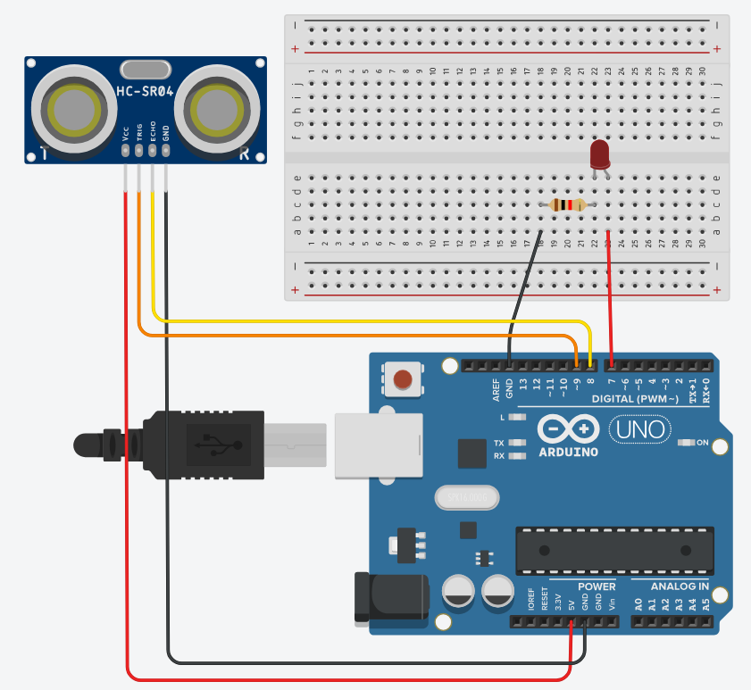

author: Jeong Seongmoon
summary: 초음파 센서로 LED 점등 시켜보기
id: ultrasound
categories: codelab
environments: Web
status: Published
feedback link: https://github.com/msaltnet/coding-camp

# 초음파 센서로 LED 점등 시켜보기

## Overview
Duration: 0:01:00

초음파 센서에 대해서 알아보고 아두이노를 통해서 초음파로 거리를 측정하는 방법을 배웠습니다.

이번에는 거리에 따라 다르게 LED를 깜빡이는 회로와 프로그램을 만들어 봅시다.

### 사전 준비
1. 아두이노 보드
1. 아두이노와 연결 가능한 PC와 IDE
1. 브레드보드
1. LED 소자
1. 저항 220옴
1. 초음파 센서

### 배우게 될 것
1. 초음파 센서와 LED와 저항의 연결 방법
1. LED를 깜빡이는 프로그램 작성 및 실습

// 완성 회로

## 초음파 센서부터 장애물까지 거리 측정하여 LED 깜빡이는 회로 - 문제
Duration: 0:10:00

앞에서 초음파 센서로 장애물까지 거리를 측정하는 회로를 구성해 보았습니다.

이번에는 그 회로에 LED를 깜빡일 수 있는 회로를 추가로 직접 구성해 보세요.

잘 모르겠으면 살짝 다음으로 넘어가서 회로를 보아도 됩니다. 😀

## 초음파 센서부터 장애물까지 거리 측정하여 LED 깜빡이는 회로 - 답안
Duration: 0:10:00

연결하는 방법은 한 가지로 정해져 있는 것이 아닙니다. 답안은 참고용으로 사용하세요.

중요한 것은 저항과 LED, 아두이노 핀은 함께 연결되어야 합니다.



## 초음파 센서부터 장애물까지 거리 측정하여 LED 깜빡이는 프로그램 - 문제
Duration: 0:10:00

이제 실제로 초음파 센서부터 장애물까지의 거리를 측정해서 다른 속도로 깜빡이는 프로그램을 만들어 보세요.

초음파 센서로부터 거리를 측정하는 프로그램과 LED를 깜빡이는 프로그램을 참고해서 하나의 프로그램을 만들면 됩니다.

참고용 거리 측정하는 프로그램입니다.

```c
#define TRIG_PIN_NUM 9 //TRIG 핀과 연결된 아두이노 핀 번호 (초음파 보내는 핀)
#define ECHO_PIN_NUM 8 //ECHO 핀과 연결된 아두이노 핀 번호 (초음파 받는 핀)

void setup() { //setup은 처음 한 번 실행되는 함수 입니다.
  Serial.begin(9600); //PC와 시리얼 통신을 설정

  pinMode(TRIG_PIN_NUM, OUTPUT); //TRIG 핀과 연결된 아두이노 핀을 출력으로 설정
  pinMode(ECHO_PIN_NUM, INPUT); //ECHO 핀과 연결된 아두이노 핀을 입력으로 설정
}

void loop() { //loop는 계속 반복 실행되는 함수 입니다.
  long duration, distance;

  digitalWrite(TRIG_PIN_NUM, LOW); //TRIG 핀의 신호를 LOW로 설정
  delayMicroseconds(2); // 2마이크로세컨드(0.000002초) 대기, 센서의 동작을 기다림

  digitalWrite(TRIG_PIN_NUM, HIGH); //TRIG 핀의 신호를 HIGH로 설정
  delayMicroseconds(10);  // 10마이크로세컨드(0.00001초) 대기, 센서의 동작을 기다림

  digitalWrite(TRIG_PIN_NUM, LOW); //TRIG 핀의 신호를 LOW로 설정

  duration = pulseIn(ECHO_PIN_NUM, HIGH); //물체에 반사되어돌아온 초음파의 시간을 변수에 저장합니다.
  // "pulseIn" Returns the length of the pulse in microseconds or gives up and returns 0 if no complete pulse was received within the timeout.

  // 거리를 구하는 공식의 단위를 맞춰서 계산해야 합니다.
  // 34000 * 초음파가 물체로 부터 반사되어 돌아오는시간 / 1000000 / 2 (왕복거리이므로 나누기 2를 해줍니다.)
  // 각각 m(미터) -> cm(센티미터), s(초) -> micro sec(마이크로 초)
  // 식을 정리하면 아래와 같습니다.
  distance = duration * 17 / 1000; 

  // PC모니터로 초음파 거리값을 확인 하는 코드 입니다.
  Serial.println(duration ); // 초음파가 반사되어 돌아오는 시간을 보여줍니다.
  Serial.print("\nDIstance : ");
  Serial.print(distance); // 측정된 물체로부터 거리값(cm값)을 보여줍니다.
  Serial.println(" cm");

  delay(1000); // 1초 대기하고 다시 측정해서 값을 보여줍니다.
}
```

참고용 LED 깜빡이는 프로그램입니다.

```c
#define LED_PIN_NUM 8 // LED의 긴다리 핀과 연결된 아두이노 핀 번호 (+핀)

void setup() { //setup은 처음 한 번 실행되는 함수 입니다.
    pinMode(LED_PIN_NUM, OUTPUT); // LED의 긴다리 핀을 출력으로 설정
}

void loop() { //loop는 계속 반복 실행되는 함수 입니다.
    digitalWrite(LED_PIN_NUM, HIGH); // LED와 연결된 핀에 전압을 5V로 설정
    delay(1000); // 1초(1000밀리초) 동안 대기
    digitalWrite(LED_PIN_NUM, LOW); // LED와 연결된 핀에 전압을 0V로 설정
    delay(1000);
}
```

## 초음파 센서부터 장애물까지 거리 측정하여 LED 깜빡이는 프로그램 - 답안
Duration: 0:05:00

아래 코드를 IDE에 복사해 넣고 업로드를 합니다. 아래 코드가 어떤 내용인지는 코드에 달려있는 설명을 읽어보며 혼자 차근차근 이해해보세요~😉

```c
#define TRIG_PIN_NUM 9 //TRIG 핀과 연결된 아두이노 핀 번호 (초음파 보내는 핀)
#define ECHO_PIN_NUM 8 //ECHO 핀과 연결된 아두이노 핀 번호 (초음파 받는 핀)
#define LED_PIN_NUM 7 //LED와 연결된 아두이노 핀 번호

void setup() { //setup은 처음 한 번 실행되는 함수 입니다.
  Serial.begin(9600); //PC와 시리얼 통신을 설정

  pinMode(TRIG_PIN_NUM, OUTPUT); //TRIG 핀과 연결된 아두이노 핀을 출력으로 설정
  pinMode(ECHO_PIN_NUM, INPUT); //ECHO 핀과 연결된 아두이노 핀을 입력으로 설정
}

void loop() { //loop는 계속 반복 실행되는 함수 입니다.
  int blink_interval = 0;
  long distance = check_distance(); // 거리를 측정해서 distance에 저장합니다.
  int total_duration = 0;

  // 거리에 따라서 깜빡이는 속도를 다르게 설정합니다.
  if (distance > 40) {
    // 40cm보다 멀리 있을 때 설정
    blink_interval = 1000;
  } else if (distance > 30) {
    // 30cm보다 멀리 있을 때 설정
    blink_interval = 700;
  } else if (distance > 20) {
    // 20cm보다 멀리 있을 때 설정
    blink_interval = 500;
  } else if (distance > 10) {
    // 10cm보다 멀리 있을 때 설정
    blink_interval = 200;
  } else {
    // 10cm보다 가까이 있을 때 설정
    blink_interval = 100;
  }

  while (true) { // 계속 반복되는 블럭
    blink_led(blink_interval) // blink_interval 동안 led를 깜빡임
    total_duration = total_duration + blink_interval; // 깜빡인 시간을 더함

    if (total_duration >= 2000){
      // 깜빡인 시간을 모두 더한 값이 2초 이상이면 반복을 중단함
      break;
    }
  }
}

// 주어진 시간 동안 led를 깜빡이는 함수입니다.
void blink_led(int duration)
{
  int half = duration / 2;
  digitalWrite(LED_PIN_NUM, HIGH);
  delay(half);
  digitalWrite(LED_PIN_NUM, LOW);
  delay(half);
}

// 거리를 측정해서 반환하는 함수입니다.
long check_distance()
{
  long duration, distance;

  digitalWrite(TRIG_PIN_NUM, LOW); //TRIG 핀의 신호를 LOW로 설정
  delayMicroseconds(2); // 2마이크로세컨드(0.000002초) 대기, 센서의 동작을 기다림

  digitalWrite(TRIG_PIN_NUM, HIGH); //TRIG 핀의 신호를 HIGH로 설정
  delayMicroseconds(10);  // 10마이크로세컨드(0.00001초) 대기, 센서의 동작을 기다림

  digitalWrite(TRIG_PIN_NUM, LOW); //TRIG 핀의 신호를 LOW로 설정

  duration = pulseIn(ECHO_PIN_NUM, HIGH); //물체에 반사되어돌아온 초음파의 시간을 변수에 저장합니다.
  // "pulseIn" Returns the length of the pulse in microseconds or gives up and returns 0 if no complete pulse was received within the timeout.

  // 거리를 구하는 공식의 단위를 맞춰서 계산해야 합니다.
  // 34000 * 초음파가 물체로 부터 반사되어 돌아오는시간 / 1000000 / 2 (왕복거리이므로 나누기 2를 해줍니다.)
  // 각각 m(미터) -> cm(센티미터), s(초) -> micro sec(마이크로 초)
  // 식을 정리하면 아래와 같습니다.
  distance = duration * 17 / 1000; 

  // PC모니터로 초음파 거리값을 확인 하는 코드 입니다.
  Serial.println(duration ); // 초음파가 반사되어 돌아오는 시간을 보여줍니다.
  Serial.print("\nDIstance : ");
  Serial.print(distance); // 측정된 물체로부터 거리값(cm값)을 보여줍니다.
  Serial.println(" cm");

  delay(1000); // 1초 대기하고 다시 측정해서 값을 보여줍니다.

  return distance
}
```

초음파 센서와 손의 거리를 변경하면 LED가 깜빡이는 속도가 변경되는 것을 확인 할 수 있습니다.

//사진

<aside class="positive">
도전!<br>
프로그램을 이해하고 다양한 방식으로 프로그래밍해보아요<br>
1. LED가 깜빡이는 시간을 변경해보기<br>
2. 측정된 거리를 변경해보기<br>
3. 멀리 있을때는 깜빡이지 않게 해보기<br>
</aside>

## 정리
Duration: 0:01:00

아두이노와 브레드보드, LED, 저항 그리고 초음파센서를 이용해서 조금 더 복잡한 프로그래밍을 해보았습니다.

조금 어려울 수도 있지만, 초음파를 이용해서 다양한 프로그램을 만들 수 있다는 것을 느꼈을 거에요.

과학시간에 배운 것을 활용해서 실생활에 사용할 수 있을 만한 프로그램을 만들어 보세요!

- 초음파의 거리에 따라 LED를 다르게 깜빡거리게 할 수 있다.
- 초음파를 이용해서 자동차 앞에 장애물이 있는지 확인하고 자동차를 멈춰서게 할 수 있다.
