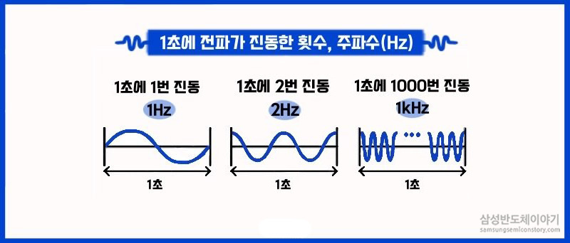

author: Jeong Seongmoon
summary: Buzzer로 멜로디 재생해보기
id: buzzer-quiz
categories: codelab
environments: Web
status: Published
feedback link: https://github.com/msaltnet/coding-camp

# Buzzer로 멜로디 재생해보기

## 시작하기
Duration: 0:01:00

Buzzer에 대해서 알아보고 아두이노를 통해서 Buzzer로 소리를 내는 방법에 대해서 알아봅니다.

### 사전 준비
1. 아두이노 보드
1. 아두이노와 연결 가능한 PC와 IDE
1. Buzzer 소자

### 배우게 될 것
1. Buzzer란 무엇인가
1. Buzzer와 아두이노 연결방법
1. Buzzer로 소리를 내는 프로그램 작성 및 실습

### 도전
Buzzer로 멜로디를 재생해보자

## Buzzer란
Duration: 0:02:00

**전기가 통하면 소리가 나는 반도체 소자!**

Buzzer란 우리가 일상 생활에서 이미 많이 사용하고 있는 소자입니다. 버스 벨이나 초인종과 같은 기능으로 사용하기도 합니다.


<aside class="positive">
농구에서 경기 시간이 종료 Buzzer가 울릴때 던진 슛을 Buzzer Beater 버저비터라고 합니다.
</aside>

Buzzer가 우리가 원하는 소리를 내게 하기 위해서는 주파수의 개념을 이해해야 합니다. 주파수는 1초 동안 전파나 음파가 진동하는 횟수를 뜻합니다.

[슬기로운 전기생활을 위한 전기상식용어 ‘주파수’](https://news.samsungsemiconductor.com/kr/%EC%8A%AC%EA%B8%B0%EB%A1%9C%EC%9A%B4-%EC%A0%84%EA%B8%B0%EC%83%9D%ED%99%9C%EC%9D%84-%EC%9C%84%ED%95%9C-%EC%A0%84%EA%B8%B0%EC%83%81%EC%8B%9D%EC%9A%A9%EC%96%B4-%EC%A3%BC%ED%8C%8C%EC%88%98/)




소리는 주파수에 따라서 음의 높낮이가 다르며, Buzzer에 흐르는 전류를 주파수를 변경하면 소리를 변경할 수 있습니다. Buzzer에 입력되는 전류의 주파수가 높을 수록 고음이 발생합니다.

## 도레미파솔라시도 소리내기
Duration: 0:10:00

Buzzer 소자는 아두이노와 바로 연결해서 사용할 수 있습니다. Buzzer의 +극을 아두이노 핀에 연결하고 -극을 GND에 연결해줍니다.


음계마다 어떤 주파수를 갖는지는 표를 보고 확인 할 수 있습니다. 4옥타브를 기준으로 프로그램을 작성해 보겠습니다.

[](https://m.blog.naver.com/geniusus/221549772862)

```c
#define NOTE_C4 261 //4옥타브 도에 해당하는 주파수
#define NOTE_D4 294 //4옥타브 레에 해당하는 주파수
#define NOTE_E4 330 //4옥타브 미에 해당하는 주파수
#define NOTE_F4 349 //4옥타브 파에 해당하는 주파수
#define NOTE_G4 392 //4옥타브 솔에 해당하는 주파수
#define NOTE_A4 440 //4옥타브 라에 해당하는 주파수
#define NOTE_B4 494 //4옥타브 시에 해당하는 주파수
#define NOTE_C5 523 //5옥타브 도에 해당하는 주파수

#define BUZZER_PIN_NUM 8//아두이노와 연결된 핀 번호
int tonesCount = 8; // tones 갯수 도레미파솔라시도 8개
int tones[] = {
  NOTE_C4,
  NOTE_D4,
  NOTE_E4,
  NOTE_F4,
  NOTE_G4,
  NOTE_A4,
  NOTE_B4,
  NOTE_C5
}; //4옥타브 도레미파솔라시도에 해당하는 주파수

void setup() {
}

void loop() {
  for(int i = 0; i < tonesCount; i++) //soundListCount 만큼 반복
  {
    tone(BUZZER_PIN_NUM, tones[i]); //tones의 i번째 주파수를 재생
    delay(500); //0.5초 동안 재생
  }
  noTone(BUZZER_PIN_NUM); //재생중지
  delay(1000); //1초 대기
}
```

## 짧은 멜로디 재생하기
Duration: 0:15:00

도레미파솔라시도에 대한 소리를 발생시켜봤습니다.
모두 0.5초 동안 소리가 나게했는데, 이번에는 소리가 나는 시간까지 정해서 멜로디를 재생해 보겠습니다.

음 하나의 주파수와 길이를 하나의 정보로 전달하기 위해서 `struct sound`라는 구조체를 정의했습니다.

연주할 음을 sound_list라는 배열에 넣어서 차례대로 연주하도록 하였습니다.

코드를 천천히 이해해보세요.

[소스코드 파일](https://github.com/msaltnet/coding-camp/blob/main/code/buzzer.ino)

```c
#define NOTE_C4  262 //4옥타브 도에 해당하는 주파수
#define NOTE_CS4 277 //4옥타브 도샾에 해당하는 주파수 
#define NOTE_D4  294 //4옥타브 레에 해당하는 주파수
#define NOTE_DS4 311 //4옥타브 레샵에 해당하는 주파수
#define NOTE_E4  330 //4옥타브 미에 해당하는 주파수
#define NOTE_F4  349 //4옥타브 파에 해당하는 주파수
#define NOTE_FS4 370 //4옥타브 파샵에 해당하는 주파수
#define NOTE_G4  392 //4옥타브 솔에 해당하는 주파수
#define NOTE_GS4 415 //4옥타브 솔샵에 해당하는 주파수
#define NOTE_A4  440 //4옥타브 라에 해당하는 주파수
#define NOTE_AS4 466 //4옥타브 라샵에 해당하는 주파수
#define NOTE_B4  494 //4옥타브 시에 해당하는 주파수
#define NOTE_C5  523 //5옥타브 도에 해당하는 주파수
#define NOTE_CS5 554
#define NOTE_D5  587
#define NOTE_DS5 622
#define NOTE_E5  659
#define NOTE_F5  698
#define NOTE_FS5 740
#define NOTE_G5  784
#define NOTE_GS5 831
#define NOTE_A5  880
#define NOTE_AS5 932
#define NOTE_B5  988
#define NOTE_C6  1047
#define NOTE_CS6 1109
#define NOTE_D6  1175
#define NOTE_DS6 1245
#define NOTE_E6  1319
#define NOTE_F6  1397
#define NOTE_FS6 1480
#define NOTE_G6  1568
#define NOTE_GS6 1661
#define NOTE_A6  1760
#define NOTE_AS6 1865
#define NOTE_B6  1976

#define MUTE 0 //무음 처리를 위해서 추가

#define DURTION_WHOLE     0
#define DURTION_HALF      400
#define DURTION_QUARTER   200
#define DURTION_EIGHTH    100
#define DURTION_SIXTEENTH 50

struct sound {
  int tone;
  int durationMs;
};

#define BUZZER_PIN_NUM 8//아두이노와 연결된 핀 번호
struct sound soundList[] = { //주파수와 음의 길이 정보를 갖는 구조체의 배열
  {NOTE_G4, DURTION_QUARTER},
  {NOTE_A4, DURTION_QUARTER + DURTION_EIGHTH},
  {MUTE,    DURTION_SIXTEENTH},
  {NOTE_B4, DURTION_QUARTER + DURTION_EIGHTH},
  {MUTE,    DURTION_SIXTEENTH},
  {NOTE_E5, DURTION_QUARTER},
  {NOTE_D5, DURTION_HALF + DURTION_EIGHTH}
};
int soundListCount = 7;

void setup() {
  Serial.begin(9600); //PC와 시리얼 통신을 설정
}

void loop() {
  for(int i = 0; i < soundListCount; i++) //soundListCount 만큼 반복
  {
    if (soundList[i].tone == MUTE) { //무음인 경우
      noTone(BUZZER_PIN_NUM);
    } else {
      tone(BUZZER_PIN_NUM, soundList[i].tone); //soundList의 i번째 주파수를 재생
    }
    delay(soundList[i].durationMs); //1초 대기
  }
  noTone(BUZZER_PIN_NUM); //재생중지
  delay(1000); //1초 대기
}
```

## 정리
Duration: 0:02:00

소리가 주파수를 갖고 있는 음파라는 사실을 알게되었습니다.

아두이노와 Buzzer를 이용해서 간단한 소리와 조금 복잡한 멜로디를 재생해 보았습니다.

버튼을 이용해서 간단하 피아노를 만들어 보거나 독특한 벨을 만들 수 있을 것 같아요.

- 소리는 주파수가 있는 음파를 뜻한다.
- Buzzer에 주파수가 있는 전류를 흘려보내면 그 주파수를 갖는 소리가 난다.
- 반도체를 통해서 소리를 마음대로 낼 수 있는 프로그램을 만들 수 있다.

### 참고
- [tone()](https://www.arduino.cc/reference/ko/language/functions/advanced-io/tone/)
- [noTone()](https://www.arduino.cc/reference/ko/language/functions/advanced-io/notone/)
