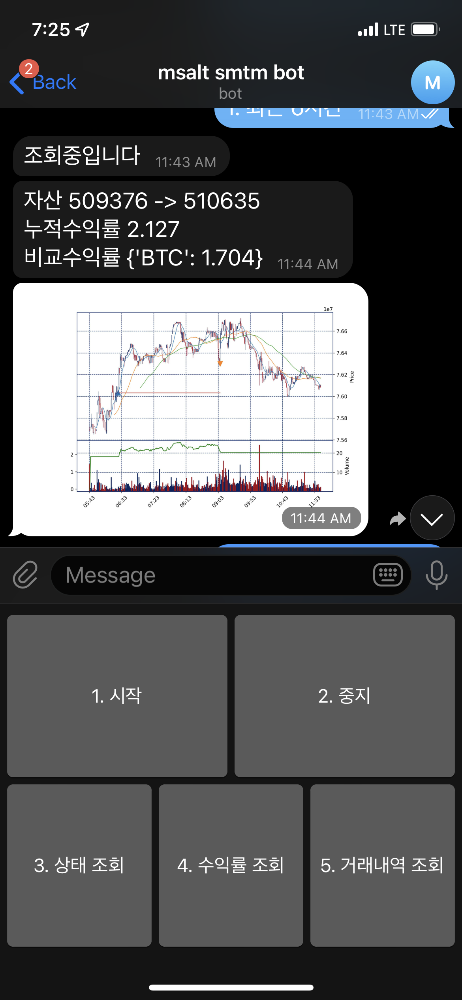

author: Jeong Seongmoon
summary: 코드랩 샘플 요약 문장
id: code-lab-sample-id
categories: codelab,sample
environments: Web
status: Published
feedback link: https://github.com/msaltnet/coding-camp

# 코드랩 샘플

## CodeLab Overview
Duration: 0:02:00

이 코드랩에서는 샘플 문서의 형식을 취한다.

### 사전 준비
1. python (3.6 이상 권장)
1. 인터넷 환경
1. 텔레그램 계정

### 배우게 될 것
1. pip를 사용해서 smtm을 설치하는 방법
1. 설치한 smtm을 사용하는 방법
1. smtm 컨트롤러 사용방법

[무료 오픈소스 암호화폐 자동매매 시스템 smtm 바로 써보기](https://youtu.be/la-IGHgI95g) 영상을 통해 코드 랩과 동일한 내용을 확인 할 수 있습니다.



## smtm 설치
Duration: 0:02:00

smtm은 암호화폐 자동매매 오픈소스 프로젝트로써 깃허브에 [소스코드](https://github.com/msaltnet/smtm)가 공개되어 있습니다. 또한 [pypi.org](https://pypi.org/project/smtm/)에 패키지가 등록되어 있습니다.

python이 설치된 환경에서 python 패키지 관리 프로그램 pip를 통해서 smtm 패키지를 설치합니다.

```
(venv) PS C:\smtm> pip install smtm
Collecting smtm
  Downloading smtm-1.2.0-py3-none-any.whl (80 kB)
     |████████████████████████████████| 80 kB 5.5 MB/s
Requirement already satisfied: pyjwt in c:\venv\lib\site-packages (from smtm) (2.0.1)
Requirement already satisfied: python-dotenv in c:\venv\lib\site-packages (from smtm) (0.19.0)
Requirement already satisfied: requests in c:\venv\lib\site-packages\requests-2.25.0-py3.6.egg (from smtm) (2.25.0)
...
Installing collected packages: smtm
Successfully installed smtm-1.2.0
(venv) PS C:\smtm> 
```

<aside class="positive">
효과적인 패키지 관리를 위해서 <a href="https://packaging.python.org/en/latest/guides/installing-using-pip-and-virtual-environments/#creating-a-virtual-environment">virtual environment</a>을 사용할 것을 권장합니다.
</aside>

pip를 사용하지 않고 소스코드와 패키지를 깃허브에서 다운로드하여 사용할 수도 있습니다.

[github smtm repo](https://github.com/msaltnet/smtm)에 접속해서 [설치방법](https://github.com/msaltnet/smtm#%EC%84%A4%EC%B9%98%EB%B0%A9%EB%B2%95)을 확인해 보세요.

## 정리
Duration: 0:01:00

간단하게 smtm을 설치하고 모의 투자를 실행해보았습니다. 그리고 투자 결과 조회를 확인해 보았습니다.

기본 제공되는 전략을 참고하여 직접 전략을 만들어 보세요. 그리고 대량 시뮬레이션을 통해서 전략을 최적화 보세요.

실제 계좌로 거래를 진행하기 위해서는 거래소 계좌와 API 토큰이 필요합니다. 자세한 내용은 [암호화폐 자동매매 프로그램 smtm - 실전 거래 해보기](https://youtu.be/lTeXUP-JXQc) 영상을 확인해 보세요.

해당 프로그램은 오픈소스로 무료 제공되고 있으며, 필요에 따라 자유롭게 수정하여 사용이 가능합니다.

### 더 알아보기
- [썰 - 왜 암호화폐인가](https://youtu.be/lwrMAJzy8V4)
- [smtm 사용팁 - 그래프에 스팟 그래프 추가하기](https://youtu.be/FR14ZodyDqA)
- [암호화폐 자동매매 시스템 smtm - 대량 시뮬레이션](https://youtu.be/i6g2VhPl7hQ)
- [무료 오픈소스 암호화폐 자동매매 시스템 smtm 바로 써보기](https://youtu.be/la-IGHgI95g)
